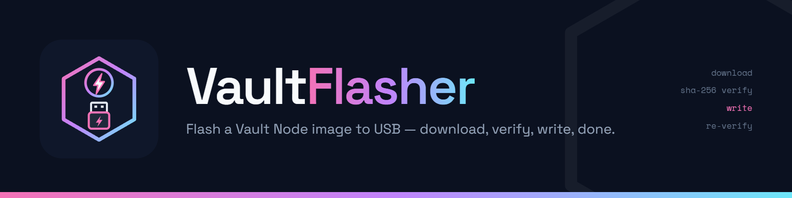
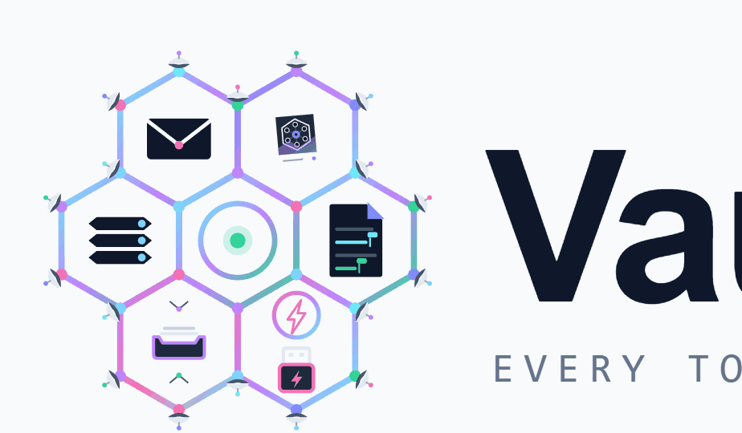

# Vault Flasher — releases



> Pick a stick. Click Flash. Boot a node.

Official download mirror for **Vault Flasher**, the one-click USB flasher for
[Vault Node](https://ccgnomes.com/vaultnode/) images. Pick a USB stick, click
Flash — the app downloads the current node image, verifies its SHA-256 against
the release's published digest, writes it (one admin prompt), and verifies the
write by reading it back. Only removable USB drives are ever offered — never an
internal or system disk.

## Download (Windows 10/11, x64)

- **Installer (recommended):** [VaultFlasher-x64-setup.exe](https://github.com/markCCGnomes/vault-flasher-releases/releases/latest/download/VaultFlasher-x64-setup.exe)
- MSI alternative: [VaultFlasher-x64.msi](https://github.com/markCCGnomes/vault-flasher-releases/releases/latest/download/VaultFlasher-x64.msi)

### "Windows protected your PC"?

The installer is currently unsigned, so SmartScreen warns on first run. That is
expected: click **More info**, then **Run anyway**. (Verify the installer's
SHA-256 against the release notes if you want certainty.) A SmartScreen-free
`winget install CCGnomes.VaultFlasher` path is in progress.

## One-click launch from the web

Installing registers the `vaultflasher://` link handler, so setup pages can
open the app pre-filled:

```
vaultflasher://flash?tag=<release-tag>&arch=<amd64|arm64>
```

The link only pre-fills tag/arch (it can never carry a URL or start a write) —
flashing always requires clicking **Flash** in the app.

## License

Free to download and use under the **Vault Ecosystem License v1.1** (see
[LICENSE](LICENSE)). No redistribution or modification. Third-party components:
see THIRD-PARTY-NOTICES.md attached to each release.

---

<picture>
  <source media="(prefers-color-scheme: dark)" srcset="brand/vaultsuite-lockup-reversed-2x.png">
  
</picture>

Vault Flasher is part of the **VaultSuite** family — self-hosted, first-party
tools: [Vault Node](https://ccgnomes.com/vaultnode/), Parley, ReelVault,
VaultDrive, VaultDocs, and friends.
